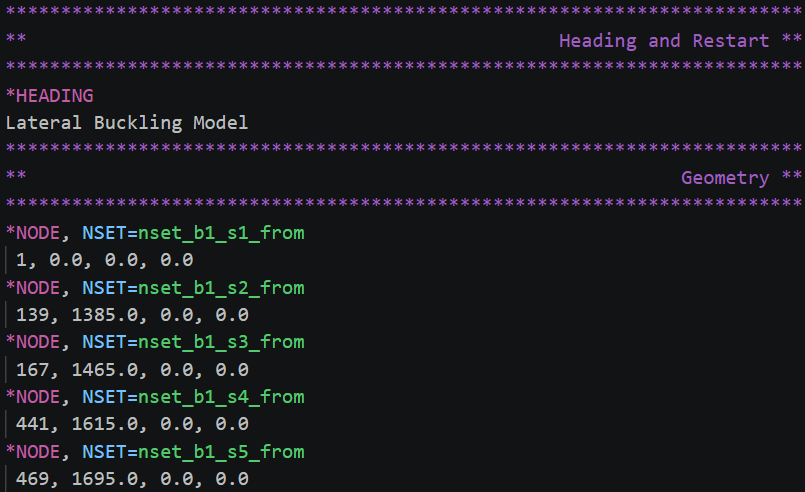
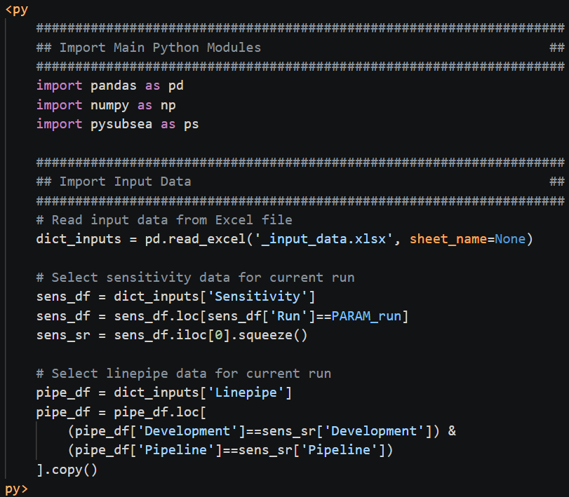
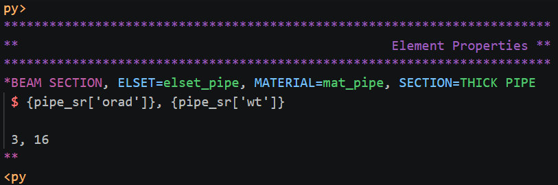

# AbaqusPy: Input File Syntax Highlighter for Abaqus

AbaqusPy is an open-source framework, distributed as part of [PySubsea](https://pypi.org/project/pysubsea/), for extending Abaqus `.inp` workflows with lightweight Python integration.

This Visual Studio Code extension provides syntax highlighting for Abaqus input files (`.inp`), including standard Abaqus syntax and AbaqusPy extensions.

## AbaqusPy Syntax Extensions

AbaqusPy extends the standard Abaqus `.inp` syntax with:

- `<py` and `py>` blocks for embedded Python logic, loops, calculations, and variable definitions
- `$` output markers for writing Python-generated lines into the final executable Abaqus .inp file

## Features

- Highlights Abaqus keywords and directives (e.g. `*NODE`, `*ELEMENT`, etc.).
- Highlights AbaqusPy `<py` and `py>` Python blocks.
- Highlights AbaqusPy `$` output markers used for generating the final Abaqus input file.
- Improves readability of complex `.inp` files used in automation and parametric workflows.

## Preview

#### Example of Abaqus Syntax Highlighting:

#### Example of Python `<py` and `py>` Block Syntax Highlighting:

#### Example of Python `$` Block Syntax Highlighting:

## Extension Details

- **Publisher:** `ismael-ripoll`
- **Extension Name:** `abaquspy-input-file-syntax-highlighter`
- **Identifier:** `ismael-ripoll.abaquspy-input-file-syntax-highlighter`
- **Credits:** Developed in collaboration with Subsea Energies (https://www.subseaenergies.com)

## Dependencies

AbaqusPy integrates with the open-source PySubsea framework:

- PySubsea (PyPI): https://pypi.org/project/pysubsea/
- PySubsea repository: https://github.com/py-subsea/py-subsea
- PySubsea documentation: https://py-subsea.github.io/py-subsea/

## License

- PySubsea is licensed under a MIT License (see [LICENSE](./LICENSE) for details).
- AbaqusPy is therefore also licensed under a MIT License.

## Trademark Notice

AbaqusPy is an independent open-source project and is not affiliated with, endorsed by, or sponsored by Dassault Systèmes. Abaqus is a trademark of Dassault Systèmes.